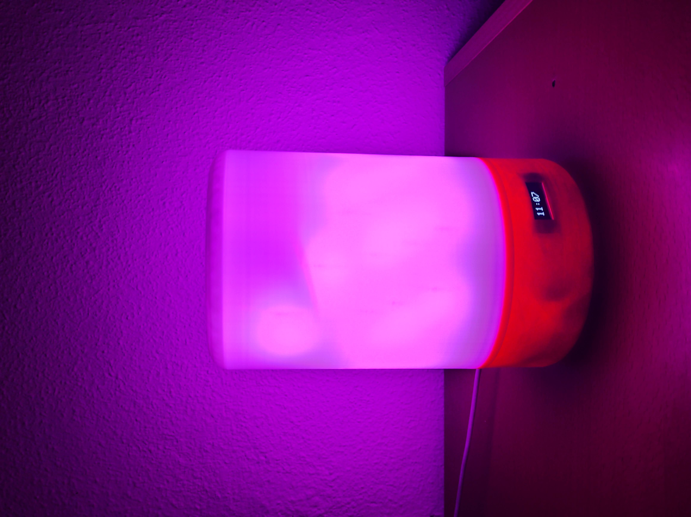

# LED-LAMP

This is a personal project i did during the time i was looking for a job. I was inspired by a project frome a guy caled @dukedoks which for me is a reference in this world. At first it was going to be just a simple lamp but finally its a lamp, watch, alarm and speaker. It is based on a ESP8266, the LEDs are WS2812, it  has an OLED 0.91", a speaker I got from some old speakers, a MH-M38 for controlling the speakers via Bluetooth and a USB-C connector for supplying it all. The case, the base and the inner column were designed in freecad and printed in an Ender 3 Pro.

